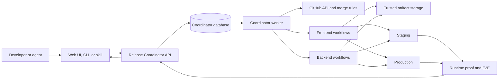

# 6529 Release Coordinator

6529 Release Coordinator is a proposed control plane for moving exact frontend
and backend changes through merge, build, staging, validation, production, and
recovery without requiring a developer or agent to watch the release.

Status: **design only**. This repository does not yet contain a running API,
worker, database, GitHub App, or deployment authority.

[Open the interactive process diagram](./release-coordinator-process.html)

## The problem

Many developers and agents want to release work at the same time. Today, merge
and deployment are too tightly connected:

- one deployment may require `main` to stay unchanged for a long time;
- another PR can merge while a deployment is running and invalidate a later
  `main` equality check;
- frontend and backend PRs may need a specific order;
- shared staging and production cannot safely accept overlapping mutations;
- someone must keep watching workflows, tests, retries, and recovery;
- it is difficult to answer what is queued, what is running, and what exact
  code is deployed.

The Coordinator should make release submission asynchronous and durable:

> Submit exact ready PRs and their dependencies. The system owns the release
> until it finishes or reaches a problem that genuinely needs a human.

## Core rule: freeze the release, not `main`

The normal path deploys exact commits that have already been merged into
`main`. It does not deploy contributor branches.

1. The Coordinator briefly gets the next merge turn for the affected
   repositories.
2. It rechecks the exact PR heads and current `main` bases.
3. It merges the accepted PRs in a dependency-safe order.
4. It records the resulting exact frontend and backend `main` SHAs.
5. It builds immutable release artifacts from those recorded SHAs.
6. Other PRs may continue merging while the saved release moves through
   staging and production.

After a release is frozen, runtime verification compares the running system
with the saved release manifest and artifact digests. It never requires the
running release to equal the newest `main`.

Example:

- Release A records frontend `main` at `F101` and backend `main` at `B201`.
- Later work moves the branches to `F102` and `B202`.
- Release A still deploys the immutable artifacts for `F101` and `B201`.
- The later commits belong to a later release.

## Product promise

A developer, automation, or agent can submit one release request containing:

- exact frontend and backend PR numbers and 40-character head SHAs;
- dependencies between PRs;
- order among otherwise independent PRs;
- affected backend deployable services and their dependency edges;
- requested rollout policy, such as staging only, approval before production,
  or automatic production continuation after staging;
- requester identity and request time.

Once accepted, the Coordinator queues, merges, builds, deploys, tests, retries,
recovers, and reports the exact outcome. The submitter does not need to keep a
browser, terminal, or agent task open.

## Architecture



The Coordinator is a separate system. It coordinates the product repositories
but does not copy their build, deployment, E2E, notification, or release-note
logic.

### Coordinator owns

- authenticated release submission;
- the durable cross-repository queue;
- dependency resolution and stable ordering;
- release state, attempts, leases, errors, and history;
- short repository merge turns;
- staging and production environment ownership;
- workflow dispatch and result correlation;
- exact release manifests and artifact identities;
- retries, safe recovery, and notifications.

### Product repositories own

- PR review and CI;
- how frontend and backend code is built;
- the list of valid backend deployable services;
- how each service is deployed;
- runtime version reporting;
- repository-specific tests and E2E entry points;
- deployment communication and release-note implementations.

## Where requests go

All entry points call the same authenticated Coordinator API:

- a small web interface;
- a CLI command;
- a Codex or agent skill;
- a direct API client.

An illustrative request is:

```json
{
  "production_policy": "require_approval",
  "items": [
    {
      "repository": "6529seize-backend",
      "pr": 123,
      "sha": "40-character-exact-head-sha",
      "deploy_units": ["api"],
      "depends_on": []
    },
    {
      "repository": "6529seize-frontend",
      "pr": 456,
      "sha": "40-character-exact-head-sha",
      "deploy_units": ["frontend"],
      "depends_on": ["6529seize-backend#123"]
    }
  ]
}
```

The exact API contract remains a design decision. The important rule is that
all clients submit the same structured request instead of encoding release
intent in chat text, PR labels, or workflow names.

## Where queue state lives

The Coordinator uses its own transactional database, such as PostgreSQL or
MySQL. GitHub's merge queue is repository-specific, so it cannot be the source
of truth for one release spanning frontend and backend.

Minimum durable records:

- release request and requester;
- ordered release items and dependency edges;
- exact PR heads and captured `main` SHAs;
- current state and state-transition history;
- merge, build, staging, production, and E2E attempts;
- GitHub workflow run IDs and links;
- artifact digests and runtime identities;
- retry budgets, blockers, leases, and human decisions.

Only the Coordinator changes queue state. GitHub statuses and PR comments are
useful projections, but they are not the authoritative queue.

## Sources of truth

| Fact | Source of truth |
| --- | --- |
| Release intent, queue, order, and current phase | Coordinator database |
| PR number, current exact head, review, and CI | GitHub |
| Immutable build identity | Trusted artifact storage |
| What is actually running | Runtime version proof |
| Whether the running release works | Manifest-bound E2E and rollout metrics |

## How `main` is protected

`main` is always protected by GitHub repository rules. Normal users and agents
cannot push or merge directly. A narrowly permitted Release Coordinator GitHub
App is the normal merge actor.

The database queue decides order. GitHub rules enforce authority.

When a release reaches the merge phase, the Coordinator:

1. claims short merge leases for the affected repositories;
2. waits for earlier accepted work;
3. rechecks current `main`, exact PR heads, CI, review, and dependencies;
4. merges backend work before frontend work that depends on it;
5. records the exact resulting `main` SHAs;
6. releases the merge leases immediately.

Later requests then receive their merge turn. Development and PR review can
continue throughout; only the final merge operation is ordered.

GitHub cannot atomically merge two different repositories. Therefore:

- all cross-repository changes are fully preflighted before the first merge;
- backend changes must be safe to land before dependent frontend changes,
  normally through backward compatibility or a feature flag;
- if only part of the cross-repository merge succeeds, the release stops,
  records exact truth, and requires a deliberate repair;
- the system never claims that two repository merges were atomic.

An emergency administrator bypass may exist, but it is not part of the normal
release path and must be audited.

## Queues and concurrency

There are three separate kinds of ownership:

1. **Merge turns** are short and repository-scoped.
2. **Staging ownership** allows one release to mutate and validate shared
   staging.
3. **Production ownership** allows one release to mutate and validate
   production.

Many releases may validate, plan, or build concurrently. Shared environment
mutation remains serialized. Staging and production are separate lanes, so a
validated release may continue in production while the next release prepares
for staging.

An environment must never move backward by accident. A later release can
deploy only after all earlier required releases are terminal, unless an
explicit rollback or supersession decision changes that order.

## Release lifecycle

The first proposed state model is:

```text
SUBMITTED
  -> VALIDATING
  -> READY_TO_MERGE
  -> MERGING
  -> BUILDING
  -> WAITING_FOR_STAGING
  -> STAGING
  -> STAGING_VALIDATED
  -> WAITING_FOR_PRODUCTION
  -> PRODUCTION
  -> DONE
```

Important terminal or side states:

- `CANCELLED`
- `NEEDS_HUMAN`
- `RECOVERING`
- `FAILED`

Every transition is saved before later work begins. Operations are designed to
be safe to retry, and workers claim durable leases so a restart cannot create
two owners for one mutation.

## Staging

For each release, the Coordinator:

1. acquires staging ownership;
2. deploys affected backend services in dependency order;
3. deploys independent backend services concurrently where safe;
4. deploys the frontend after required backend services;
5. verifies exact runtime identities against the saved release manifest;
6. runs complete manifest-bound staging E2E;
7. records `STAGING_VALIDATED` only when runtime and tests agree;
8. releases staging ownership.

Staging validation belongs to the saved release, not to the latest `main`.

## Production

Production is a separate promotion of the staging-validated release.

- Low-risk releases may continue automatically under an approved policy.
- Higher-risk releases require a separate human approval.
- The exact staging-validated artifacts are promoted where technically
  possible.
- If environment-specific builds are unavoidable, they use the same captured
  source SHAs and receive their own immutable artifact digests.
- Production uses canary or blue/green rollout where the platform supports it.
- Health metrics and read-only E2E decide whether rollout continues.
- Success requires exact production runtime proof and terminal successful
  validation.

The Coordinator compares production with the release manifest, never with the
newest `main`.

## Failure and recovery rules

### A waiting PR moves

Cancel or supersede the old exact request. Never silently deploy the new head.

### An active PR branch moves

The release continues with its already captured `main` commits and artifacts.
The newer PR head belongs to another request.

### Merge conflict or failed preflight

No release artifact is produced. The request becomes `NEEDS_HUMAN` with the
exact PR and blocker. Dependent items do not overtake it.

### Partial cross-repository merge

Stop. Record which `main` branch changed and which did not. Do not deploy or
pretend the merge was atomic. A human chooses the exact repair.

### Infrastructure failure

Retry only the same exact operation and artifact within a fixed budget. An
AWS, GitHub, network, or runner failure is not evidence that a PR is bad.

### Build failure

Stop before staging. `main` may contain the merged code, but the running
environments stay unchanged. Fixes enter a new release request.

### Staging product or E2E failure

Do not validate the release. Restore the last known-good staging release and
verify the restoration before releasing staging ownership. Version one does
not automatically test every PR combination; keep batches small and return a
clear `NEEDS_HUMAN` result.

### Production failure

Abort a canary before full rollout when possible. Retry only a proven
infrastructure failure. If production is partly updated or runtime truth is
unclear, pause production, preserve the exact evidence, and require explicit
repair or rollback. Never report success from workflow completion alone.

### Stop request

- Before mutation, Stop cancels the release immediately.
- After mutation begins, Stop means safe stop: finish the issued operation and
  reach a verified current or restored state before ending.

## Submit and almost forget

The API acknowledges a durable release ID. From that point, event-driven
workers and workflow callbacks continue the release without browser or agent
polling.

The submitter is notified only for meaningful outcomes:

- request accepted;
- staging validated;
- production completed;
- request cancelled because exact code changed;
- recovery completed;
- human action required, with the exact blocker and evidence links.

## Version-one scope

Version one should include:

- exact frontend and backend PR submission;
- explicit dependencies and backend deploy units;
- one durable database queue;
- GitHub-enforced protected `main` branches;
- short Coordinator-owned merge turns;
- immutable release manifests and artifacts;
- serialized staging and production ownership;
- exact runtime proof and E2E;
- bounded infrastructure retries;
- explicit production approval policy;
- terminal notifications and an operator dashboard.

## Explicit non-goals for version one

- automatic PR discovery;
- large automatic release trains;
- automatic PR-by-PR failure bisection;
- automatic cross-repository production rollback;
- pretending cross-repository merges are atomic;
- copying product build and deployment logic into the Coordinator;
- allowing two deployment authorities for the same environment;
- requiring deployed runtime to equal the newest `main`;
- holding a merge reservation during build, staging, E2E, or production.

## Open decisions

- database technology and hosting;
- API and authentication contract;
- GitHub App permissions and emergency access;
- maximum release size;
- exact merge implementation and repository rules;
- production auto-promotion policy;
- canary or blue/green capabilities per deployable;
- runtime identity contract for every frontend/backend service;
- callback authenticity and timeout policy;
- retention and audit requirements;
- disaster recovery for the Coordinator itself;
- how the Coordinator is deployed without depending on its own release path.

## Design influences

- [GitHub merge queues](https://docs.github.com/en/repositories/configuring-branches-and-merges-in-your-repository/configuring-pull-request-merges/managing-a-merge-queue)
- [GitHub deployment environments](https://docs.github.com/en/actions/reference/workflows-and-actions/deployments-and-environments)
- [Google Cloud CI/CD guidance](https://cloud.google.com/solutions/best-practices-continuous-integration-delivery-kubernetes)
- [Google SRE canary guidance](https://sre.google/workbook/canarying-releases/)

These sources guide the design, but this document is the project contract. The
first implementation must not silently add behaviour that is absent here.
