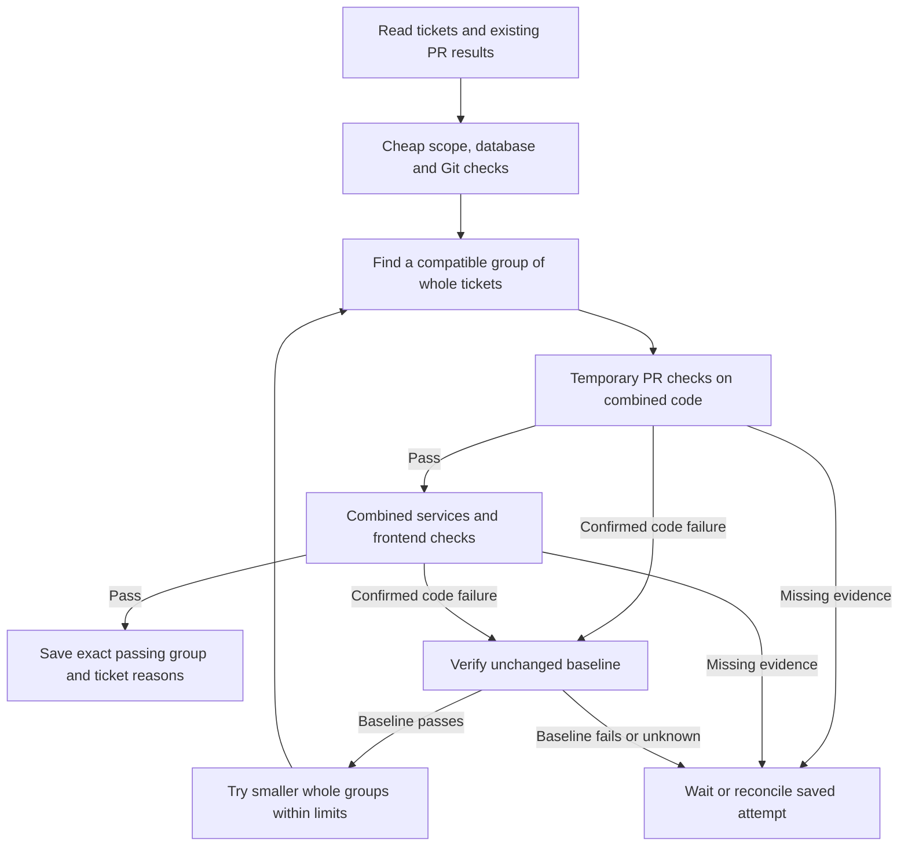
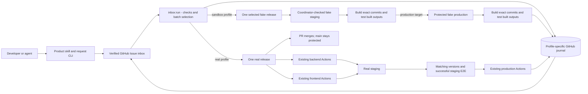

# Release execution design and implementation

The sandbox execution path is merged and live-tested. The current working tree
now uses the same Coordinator engine for real repositories: profile configuration
selects product identities, required checks, workflow pins and evidence rules,
while the shared planner/executor keeps the same batching, staging-before-production
order and database recovery decision. The real adapter has offline coverage but
has not been merged or exercised in a live product release. See
[progress](./progress.md) for that evidence boundary.
The [agreed execution direction](#agreed-execution-direction-september-11)
and [process diagram](../release-coordinator-process.html) describe the same
September 11 decisions. The sandbox implementation exercises their order; it is
not evidence that product release execution is available.

## Inbox stage before execution

The implemented smaller stage is [inbox processing](./inbox-processing.md): central
intake defaults, clear ticket statuses and reasons, submitter ownership,
recorded decisions, and migration of existing tickets. `inbox:run` now joins
initial inspection, local rehearsal, profile-specific batch/release execution,
supported sandbox service checks, and ticket updates in one manual process. A
filtered scope only limits the visible inbox; it does not replace the normal
release rules.
See progress for local, merge, and runtime evidence.

The current intake boundary excludes requests whose PRs are all already merged:
processing closes them with `already-merged`, without claiming deployment.
A verified merged PR plus an open or unverified companion keeps the request open
for a scope decision; missing evidence alone can remain waiting. Deploying already
merged work uses the existing authorized product release process; a dedicated
deployment-only request mode is not implemented. The release executor must record
execution ownership before merging and keep responsibility afterward. Its own
merge must not trigger this intake closure rule. Inbox receipt acceptance and
ticket processing are not execution ownership.

That document owns the first-processing contract. Schema `0.000002` preserves
the existing application input and adds recording for operational monitoring;
the read-only commands remain. `inbox:run` combines inspection, rehearsal, supported
sandbox checks, and Issue updates. A rehearsal result does not authorize release
execution; the selected profile's saved batch and release plan own mutations.
Keep the existing GitHub journal and manual operation. A separate database,
heartbeat, dashboard and automatic takeover are not prerequisites for the next
step. The release lane is stored under today's per-command profile journal lock.

<a id="next-step-v01-run-logging"></a>

## v0.1 run logging

**Implemented September 11, 2026.** Here, v0.1 names this small Coordinator
milestone, not a new public npm package version. The existing `inbox:run` command
shows progress and saves diagnostic history. The manual recovery procedure is
unchanged. See [progress](./progress.md#v01-run-logging-september-11) for validation
and delivery evidence, including [live sandbox logging acceptance](./testing/run-logging-2026-09-11.md).

### What the logs show

- Show progress as each meaningful step starts and finishes: intake, filtering,
  Git rehearsal, temporary PR creation, waiting for checks, service execution,
  ticket updates and cleanup. Log a changed outcome, not every unchanged poll.
- Save the same events in chronological order for each run. Include UTC time,
  run ID, step, outcome and a plain explanation; include ticket/request,
  candidate/attempt, repository, PR or workflow identity and links where relevant.
  Completed steps include elapsed time.
- Distinguish **started**, **succeeded**, **failed**, **unknown** and
  **interrupted**. Starting a GitHub request is not proof that it succeeded.
  A lost response stays uncertain until the existing reconciliation verifies it.
- Explain stops precisely. If backend `main` changes, name that repository and
  record the expected and observed commits. Say that the old result cannot be
  used. Report cleanup separately: what was verified removed, what remains,
  and what is unknown. Do not claim cleanup succeeded merely because it started.
- On explicit resume, append a visible resume boundary to the same run's history
  and retain existing attempt identities. End a normal run with its outcome,
  unfinished work, any existing recovery instruction, and the log location.

For example: “Backend main changed during testing. These results belong to the
previous version. The temporary test PRs were cleaned up; a fresh run is needed.”
That cleanup sentence is valid only after cleanup has been verified. If cleanup
is incomplete, name the remaining owned PRs/branches and the required next action.
This addresses the explanation gap recorded in CT-05; it does not change when
stale evidence is rejected.

### Where the information lives

Detailed logs live on the machine running the command, outside individual
checkouts: `~/.6529-release-coordinator/logs/PROFILE/INBOX_REPOSITORY_ID/RUN_ID.jsonl`.
The command reports the actual path. Profile and immutable inbox repository ID
separate histories; files contain one JSON event per line and use private local
permissions. Each command invocation has its own ID inside the events.

Before acquiring the journal lock, a new command writes a `startup-UUID.jsonl`
file. After acquisition, it moves that same history to the assigned run ID without
replacing an existing file. An early failure retains the startup file. Explicit
resume appends to the run's existing file, including a resume boundary. If a crash
left a partial final line, preserve those bytes, begin new events on a separate
line and report the old incomplete tail. Logs are diagnostics, not replay input.
They survive changing checkout or branch but are not a shared board or journal backup.

The existing `codex/inbox-state` journal remains the source for recorded intent,
ownership, attempts and recovery decisions. Save those records before the same
external actions as today. Local logs are for explanation, never imported as
passing evidence or permission to continue. Preserve the v5 writer boundary,
current attempt budgets and profile permissions.

Logs contain selected Coordinator events and bounded error codes, not raw Actions
output, exception dumps, environment dumps or full request bodies. Known credential
values and token patterns are redacted from diagnostic text. Live progress goes to
stderr; `--json` stdout remains one final result with `logging.file`, `complete`,
`invocation_id`, `run_id` and `previous_tail_incomplete` metadata.

Failure to initialize a log stops before inbox work. A later write failure warns
once and marks `logging.complete: false`; existing journal decisions and cleanup
continue under their existing rules. The command exits `2` even if ticket processing
finished successfully. A log failure does not erase a verified ticket result.

Remote service steps are reported when the completed workflow report is verified,
with the source start/finish times separate from local observation time. Waiting
for that workflow is visible immediately. This does not stream raw Actions logs
or poll for a heartbeat.

### Limits and finish line

There is **no heartbeat** in this step. No new live-status file or command,
GitHub status Issue/Project, dashboard, background service, automatic restart,
takeover, machine ownership/OS-lock hardening, or stop/restart control system.
Logs can show the last observed action; silence cannot distinguish slow work,
a paused process, a crash or a lost connection.

Existing Ctrl+C handling and explicit `--resume` remain. Record interruption
when the process can do so; an abrupt crash may leave only a “started” event.
Stop the old process and let in-flight requests settle before manual recovery,
following the [command guide](../apps/coordinator/README.md#journal-concurrency-and-interrupted-runs).
The CT-09 overlapping-process gap remains open: logs do not prevent a paused
process from finishing a GitHub write after ownership changes.

The cases below are covered by
[run logging tests](../apps/coordinator/test/run-log.test.mjs), using the real CLI,
journal, selection and check logic with controlled GitHub responses. The trial
cases also prepare real temporary Git repositories. These are local tests, not
new live GitHub acceptance.

| Case                             | Required result                                                                                                                            |
| -------------------------------- | ------------------------------------------------------------------------------------------------------------------------------------------ |
| Normal run                       | Ordered start/result events identify the run, relevant tickets/attempts, elapsed steps and final outcome in terminal and saved log.        |
| Failure or lost response         | Verified failure and unknown outcome are distinct; an attempted operation is never logged as confirmed success.                            |
| Main changes during checks       | Name the changed repository and both commits, reject stale proof, and report verified cleanup or remaining resources accurately.           |
| Interruption and explicit resume | Preserve earlier events and attempt IDs, mark the resume, and use journal reconciliation; a missing final event never authorizes takeover. |
| Storage and output               | Separate profiles/inboxes outside checkouts, report the path and any write failure, and preserve parseable `--json` stdout.                |
| Sensitive output                 | Useful step/errors remain visible without credentials, raw workflow output or request-body dumps.                                          |

This bounded step requires no request-schema change, consumer integration update,
package publication,
source-PR merge or deployment. The dated corner-case results remain evidence of
the earlier behavior; new tests must record their own results in progress.

## Bounded stage: sandbox merge rehearsal

The [testing plan](./merge-rehearsal-testing.md) defines local Git fixtures and
two public test GitHub repositories for sample PRs. The
[profiled inbox guide](./profiled-inbox-testing.md) adds a separate public test
inbox and the shared sandbox/real input path. Both profiles accept a verified
inbox ticket and generate the destination/merge plan internally; private test manifests
remain sandbox-only. The same engine checks exact commits and merge order,
with separate evidence for conflicts, CI/review blockers, and changing inputs.

The original profiled engine and unified command are merged and have live
sandbox proof. The command uses fresh reports to update the same ticket, with
distinct passed/blocked/unknown/stale outcomes. Real-project live acceptance
remains outstanding. See [progress](./progress.md) for exact implementation,
test, and merge evidence. Git rehearsal itself changes no shared branches and
runs no deployments; a selected batch enters the separate release phase.

This rehearsal scope requires explicit destinations and one documented merge
method. The release phase separately owns protected shared-branch changes,
workflow dispatch and matching E2E evidence.

<a id="next-bounded-stage-sandbox-services-and-database"></a>

## Sandbox services and database

**Implemented and tested September 10, 2026; sandbox only.** Source delivery is
tracked in [progress](./progress.md#sandbox-source-delivery-september-10).
One complete sandbox ticket exercises small database, worker, API, and
frontend steps. The [service/database guide](./merge-rehearsal-testing.md#service-and-database-acceptance)
owns the fixtures, temporary MySQL baseline, test matrix, evidence, and finish line.
The real backend's catalog, sequential deployment instructions, database handler,
and existing temporary-MySQL tests inform this example; the guide records pinned
sources. The local Coordinator inspects the sample database definitions and
runs the sample service checks through a pinned GitHub workflow. The controlled
local and live cases have their expected results recorded in progress; the
current real adapter has offline tests but no live product acceptance.

Keep one `inbox:run` workflow and shared decision logic. Sandbox actions
operate on isolated temporary resources, with exact service versions and results
verified before dependents start. `database_change: no` still uses the existing
database; `yes` needs an identified and verified change; unknown or contradictory
evidence holds execution. Preserve failures, partial effects, and safe retry
decisions in the same ticket's history without claiming release completion.

The shared profile selects configuration and available actions, not permissions.
The real adapter uses the same release sequence with product repositories and
pinned workflows. Its local tests do not prove product merge timing, builds,
database behavior, deployments, or recovery in a live environment.

<a id="proposed-batch-testing-and-selection"></a>

## Batch testing and selection

**Sandbox implementation, September 10, 2026.** See [progress](./progress.md)
for local checks versus live acceptance and source delivery. A sandbox
`inbox:run` selects and tests the visible whole tickets together. The visibility
may be the complete inbox or a guarded list of Issue numbers from one verified
actor; it does not change batch, database, target, or release policy. The real
profile uses the same batch and release sequence; it has offline tests only.
No manual plan, extra batch command or independent release permission is introduced.

### Cheap elimination before expensive checks

1. Verify immutable intake, exact PR versions, existing required PR checks and
   reviews, scope, dependencies and per-ticket Git merges. Reading existing CI
   results does not rerun them.
2. Inspect the supported sample files, complete service scope and database answer.
   Only self-contained staging or production tickets with verified
   `database_change: no` enter batching, and one batch has one target. A false no
   is action-needed; unsupported scope or unresolved answers stay visible with a reason.
3. Save the ordered selection and starting main commits. Try the whole group's
   Git merge. If it conflicts, build a compatible group in saved priority order,
   recording exclusions. Complete this cheap filtering before starting new CI.
4. For that group's changed repositories, open owned temporary PRs to run the
   normal required `Sandbox check`. Their exact trees must equal the locally
   rehearsed trees, and GitHub's test merge must use the saved base and head.
5. Once required PR checks pass, run the combined backend/frontend sample service
   plan through the existing pinned runtime. Passing independent repository CI
   alone is not combined application proof.

Ordinary source-PR CI continues normally. The Coordinator adds no mandatory full
application run per ticket before selecting a batch. A tree that merges cleanly
can still fail application tests; that is why later test failures may require
additional candidate checks.



### Saved order, scope and limits

The code-owned `sandbox-batch-v3` policy uses ascending GitHub Issue number as a
stable intake order. The requester cannot choose priority through `created_at`.
Each ticket is indivisible: all its parts, PRs and selected services stay together.
The current intake contract describes dependencies within a ticket. Cross-ticket
must-ship-together groups are **not yet represented or supported**; put inseparable
work in one complete ticket. Overlapping PR requests remain held by the initial
policy, without choosing a version by age.

A selection contains at most **10 tickets and 10 PRs per repository**. Its saved
search permits **40 combined Git attempts and 12 candidate check rounds**. It has
no elapsed-time cutoff: a slow but active run may keep starting rounds until it
reaches a count budget, finishes, is interrupted, or stops on invalid evidence.
Each round can run one normal PR workflow per changed repository, one combined
service workflow, and an unchanged-baseline workflow only when diagnosing a code
failure. Existing attempts still reconcile and clean up after a count budget is
reached. Ticket/PR overflow stays waiting instead of breaking up a ticket.

Historical v1 and v2 records retain their saved deadline as evidence. The
Coordinator can read and recover those records, but it no longer enforces that
retired deadline. New v3 records do not contain one.

All candidates in one search use the same saved main commits and PR versions.
Each candidate rebuilds the full service graph. Its identity includes exact
intake bindings, membership/order, code and test/runtime configuration. A changed
PR head never silently replaces accepted code; corrected code requires a new
request. Changed main or gates invalidate the usable candidate. Owned temporary
PRs are reconciled/closed before a fresh run can start.

### Bounded splitting and failure attribution

Try the compatible group first. Split a confirmed failing group into two ordered
halves, recursively within limits. Keep earlier passing candidates. If useful
parts from both halves survive, test their union before selecting it. An identical
candidate is not tested again merely to spend another attempt. The search returns
a directly tested candidate or an honest no-candidate result; it does not promise
the largest possible passing group.

Every later command re-reads the saved trials' GitHub checks and service reports
before reusing their result. The checkout log must identify a commit whose tree
and parents match the saved combination. Closed temporary PRs retain this proof;
rechecking it does not reopen them or rerun CI. Missing or changed evidence stops
reuse and requires reconciliation.

If A passes, B passes, but A+B fails, the saved priority selects A and leaves B
waiting with the exact failure and selected candidate. B is not labelled broken.
Once A actually reaches main through the sandbox sequence or a future authorized
real release process, B must be checked against that new base. A specific failure caused by B's addition can
then require a correction. The priority policy does not prove which author made
an error.

Only a verified code failure with a passing unchanged baseline permits splitting
for attribution. Runner outages, pending/skipped/cancelled checks, wrong result
identity, baseline failures and uncertain saves do not identify a bad ticket.
Missing evidence stops the search or preserves an interrupted attempt for
explicit reconciliation. Unchanged completed unknown results are retained; a new
input/configuration or a resolved interrupted attempt is needed for new evidence.

### Journal, temporary PRs and recovery

`inbox-run-v7` preserves earlier ticket, service and v4/v5/v6 batch history, including
inputs, attempts, budgets, intermediate Git results, exact temporary PR identities,
service attempts, results and cleanup. Older writers reject the marker. A saved
selection remains fixed on resume; newly arriving tickets wait for a later run.
State/ownership errors retain the existing inbox lock for explicit `--resume`.

Only branches named `codex/batch-trial-<attempt UUID>` can be created or removed by
the batch adapter. The branch/commit is saved before PR creation. Lost creation
responses reconcile by that unique head; they cannot create a replacement PR.
The original Coordinator identity block must remain unchanged at the start of the
PR description. Appended review summaries are ignored and cannot supply inputs.
The adapter verifies repository IDs, actor, required workflow blob, workflow/run
attempt, job/step, required checks, head/base commits and combined tree. It never
merges trial PRs, edits source PRs or writes product repositories/workflows.
Completed evidence is saved before trial PR closure and branch removal. An
interruption preserves owned identities until an explicit resume can finish.
Normal Actions jobs remain isolated and time-limited by the existing workflow.

An interrupted `sandbox-batch-v1` record is a recovery case, not current release
evidence. Resume validates its original targetless identity and trusted v1 policy,
then reconciles and cleans only already-started exact trials. It starts no new v1
Git or CI work. The Coordinator preserves the record, clears any selected
candidate and marks it stale. The next manual command starts a fresh v3 batch;
v1 evidence can never enter the release sequence.

[Ticket projections](./inbox-processing.md#proposed-batch-ticket-outcomes) own
labels and submitter-facing reasons. The [acceptance matrix](./merge-rehearsal-testing.md#planned-batch-acceptance)
records expected cases and the dated evidence distinguishes local tests from live
GitHub proof. Database-changing batches, cross-ticket dependency declarations,
real application execution was not part of that original batch milestone. The
current working tree extends the bounded selection to the real profile and still
supports only one database-changing ticket alone; combining two such tickets
remains deferred.

### Deferred: links between separate tickets

The agreed future direction distinguishes two rules: **“B needs A”** allows A
to proceed alone but requires A with B; **“A and B must stay together”** makes
the group indivisible. Neither rule is part of the logging milestone, and the
current request format still rejects unsupported declarations.

When this feature is built:

1. Reference immutable request IDs. A replacement request must not silently
   satisfy a link to the original.
2. Validate missing requests, incompatible targets/scopes, circular requirements
   and oversized groups before expensive tests.
3. Make selection and splitting respect the links. If A is excluded, B waits
   with a specific reason. Never split a must-stay-together group.
4. Save links with the exact selection so resume preserves them, and show the
   prerequisite/group and waiting reason on affected tickets.
5. Test the feature in sandbox and update the schema, submission CLI, intake and
   frontend/backend submission integrations together before real adoption.

The first version requires prerequisites in the same tested batch. Accepting an
earlier release as satisfying a prerequisite needs later, verified release
evidence. Until then, put inseparable work in one complete ticket; CT-20 records
the current rejection behavior, not proof of this future feature.

<a id="decisions-to-settle-before-execution"></a>

## Agreed execution direction, September 11

These decisions replace the conflicting August written and visual drafts. The
current command implements them only against the pinned sandbox repositories.

| Question                            | Agreed rule                                                                                                                                                                                                                                                                                                                                      |
| ----------------------------------- | ------------------------------------------------------------------------------------------------------------------------------------------------------------------------------------------------------------------------------------------------------------------------------------------------------------------------------------------------ |
| How many releases progress at once? | One batch from selection through staging, production, or completed recovery. Later requests may arrive and ordinary PR CI may run, but the next release does not start.                                                                                                                                                                          |
| When does `main` change?            | After staging E2E passes and production is authorized. Merge the selected exact PR versions through normal protected Git merges.                                                                                                                                                                                                                 |
| What builds reach production?       | Existing product workflows build separately for staging and production. Reuse their settings; no portable-build or environment-variable redesign.                                                                                                                                                                                                |
| What gates production?              | Successful staging deployment/version/health checks and completed successful required E2E for the recorded deployed versions. Failed E2E fails the release attempt; missing, cancelled, skipped-required, or uncertain results cannot pass.                                                                                                      |
| What happens after failure?         | Stop advancement. After shared state changed, recover the recorded batch; never split it as a recovery shortcut. Database-changing or uncertain releases require a person.                                                                                                                                                                       |
| How does automatic rollback work?   | Only for confirmed no-database-change releases: new commits undo the failed batch, required checks run, and ordinary deployment Actions rebuild and deploy the restored code. Verify recovery before releasing the lane.                                                                                                                         |
| Where does state live?              | Continue using the profile's GitHub inbox journal. Keep active records complete; archive finished records in the same repository and read them when needed. The v6 sandbox writer adds exact release operations to the v5 storage model; [live release acceptance](./testing/release-sequence-2026-09-11.md) verifies closeout and a clear lock. |

The Coordinator owns selection, ordering, authorized merges/dispatch, waiting,
evidence matching, ticket outcomes and recovery decisions. Product repositories
own builds, environment settings, secrets, deployment internals, tests and release
notes. Their existing deploy skills/workflows remain the integration interfaces.
Current product skills allow E2E to run separately without gating promotion;
the new Coordinator deliberately adds a staging E2E gate. It does not invent a
second test suite or weaken required PR/security checks.

A `target: staging` request finishes after successful staging validation and
saving its result; it never reaches production implicitly. A later explicitly
authorized production continuation must revalidate selected versions,
destinations and evidence. If another release changed those inputs, test the new
combination. A production-intended batch keeps its lane through production or
recovery, including while waiting for any required approval.

One lane serializes this Coordinator; it cannot stop unrelated humans or Actions.
Check current refs and conflicting runs before mutations and match deployed
versions to E2E. Shared staging may contain other changes: inspect and record its
actual merge composition, preserve others' work, and do not claim staging
validated a different production composition. Changed bases or scope require
fresh matching combined evidence; if that cannot be established, stop.

Conflicting runs are handled by waiting, not by racing. GitHub keeps one running
and one waiting run per concurrency group and cancels the waiting run when a
third arrives, so a Coordinator run must never queue behind someone else's
deploy. Before each merge into a shared branch and before each workflow
dispatch, the adapter lists the release workflow's queued, waiting, pending,
requested and in-progress runs in the repository it is about to change, on any
branch, and continues only when there are none. It reads both GitHub's newest
page of runs and its per-status counts, because the status-filtered listing
lags behind run transitions for seconds at a time and can omit an active run
(observed live on September 18, 2026, when a merge went ahead on a false
quiet); the workflow is quiet only when the newest page shows no unfinished run
and every count is zero, so a stale count only lengthens the wait. It rechecks
every ten seconds,
logs each check as `release.wait`, and saves the blocking runs on the step
record as `waited_for` when first seen. This wait has no time limit: the
operator decided on September 18, 2026 to wait as long as it takes rather than
add a cutoff. Ctrl-C stops the wait before anything is pressed, and resume
always lists the runs again; a saved wait note never stands in for a fresh
check. A run that someone starts in the seconds between the last check and the
press is ordered by GitHub's lock, not by the Coordinator: that gap cannot be
closed from outside GitHub, and the existing guards (the ref recheck before
dispatch, the exact-commit and version checks) decide what happens next.
The default sandbox adapter implements this against each pinned product-shaped
workflow mirror; the explicit generic fallback implements it against
`sandbox-release.yml`. Real adapters must apply the same rule to the real
lock groups (`deploy-control-<env>` and `deploy-service-<env>-<service>`,
`staging-deploy`, `web-deploy-prod`, `operational-monitoring-<env>`).
Re-dispatching a Coordinator run that was cancelled before it started remains
later work.

Verified integration references on September 11: frontend
[`deploy-6529`](https://github.com/6529-Collections/6529seize-frontend/blob/faf4aa616bc3a25ccab5a0db8162980d9cdaedd1/ops/skills/deploy-6529/SKILL.md),
[`Web Deploy - STAGING`](https://github.com/6529-Collections/6529seize-frontend/blob/faf4aa616bc3a25ccab5a0db8162980d9cdaedd1/.github/workflows/deploy-staging.yml),
[`Web Deploy - PROD`](https://github.com/6529-Collections/6529seize-frontend/blob/faf4aa616bc3a25ccab5a0db8162980d9cdaedd1/.github/workflows/build-upload-deploy-prod.yml),
backend [`deploy-6529`](https://github.com/6529-Collections/6529seize-backend/blob/a367473904f83816fd2b67ab5a88d9bfe19e288e/ops/skills/deploy-6529/SKILL.md)
and [`Deploy a service`](https://github.com/6529-Collections/6529seize-backend/blob/a367473904f83816fd2b67ab5a88d9bfe19e288e/.github/workflows/deploy.yml).
These are source observations, not deployments performed in this review.
The retired Release Bus has no design authority here.

Frontend [PR #4072](https://github.com/6529-Collections/6529seize-frontend/pull/4072)
merged on September 21 at `7471ac113cb2535940b19f036bf38f47f4d44eb6`.
The real
[`Web Deploy - PROD`](https://github.com/6529-Collections/6529seize-frontend/blob/7471ac113cb2535940b19f036bf38f47f4d44eb6/.github/workflows/build-upload-deploy-prod.yml)
workflow now accepts an optional
`expected_source_sha`. An ordinary manual dispatch may leave it empty and keeps
the previous behavior under the repository's existing human authorization. That
empty-input path is deliberate manual compatibility, not a path the Coordinator
may use. This manual behavior is a source observation read back from frontend
PR #4072, not a guarantee the Coordinator enforces. When the input is provided,
it must be a full lowercase commit SHA and must match the `main` commit GitHub
fixed for that run; otherwise the workflow stops before the production build
starts. After any in-flight-run wait is quiet, the final GitHub read before the
dispatch call must re-read frontend `main`, verify it still represents the
approved production composition, and pass that exact commit. It must not reuse
an earlier staging read. Any mismatch ends the attempt. Save it, keep the lane
for a person, mark the ticket
[`status:action-needed`](./inbox-processing.md#status-labels) with
[`reason:release-failed`](./inbox-processing.md#reason-and-scope-labels), and
require explicit authorization plus fresh matching
evidence for a new attempt; never reuse the newer SHA, omit the input or deploy
the newer composition. The failed guard changes no environment, so the
[failure and recovery rules](#failure-and-recovery-rules) start with saving and
revalidation, not a source revert. Adapter tests must cover the exact input,
refuse an omitted or malformed input on the Coordinator path, repeat the final
ref read after every wait, and treat a workflow source mismatch as a stop before
accepting any build. This closes the source race inside the workflow. The current
real adapter implements these checks, but its offline tests are not deployment
proof.

## Core rule: one release lane

Many requests may wait, but only one release batch progresses at a time.
The active batch holds the lane until its requested target succeeds or recovery
reaches a verified and saved safe result. A human-required or uncertain state
keeps the lane reserved. Later release selection/testing does not overlap it.
Developers may continue their PRs, ordinary CI and request submission.

Save the lane, batch identity and current step in the GitHub journal. Today's
per-command inbox lock does not yet provide this release-spanning ownership.
Manual resume still requires stopping the old process and settling in-flight
calls. Logs do not prove a silent process is dead. Heartbeat, automatic expiry,
automatic takeover and speculative testing against an active release are deferred.
Speculative future releases would need revalidation when the active batch changes.

## Product promise and ownership

One request names exact frontend/backend PRs, commits, release-part dependencies,
selected backend services and order, target and database-change answer. The
requester's stated name is context; the central workflow records the verified
GitHub actor. Submission, a passing rehearsal and profile selection grant no
merge or deployment authority.

The Coordinator should eventually perform the authorized sequence and save a
clear result without requiring the submitter to watch every Action. It owns:

- request verification, queue order, whole-ticket selection and reasons;
- batch identity, current phase, lane ownership, bounded retries and recovery;
- normal authorized Git merges, workflow dispatch, and matching results;
- ticket projections and links to the product workflows' evidence.

Product repositories continue owning:

- PR reviews, required checks, security gates and branch protections;
- builds, dependency installation, environment configuration and secrets;
- backend/frontend deployment and any database change mechanism;
- runtime version/health proof and E2E entry points;
- autonomous release notes, including PR/service grouping metadata.

Do not copy those implementations into the Coordinator or restore the old
Release Bus. The current request schema needs no change for these decisions.
Cross-ticket links and database-changing multi-ticket batches remain deferred.

### GitHub-only sandbox builds

This sandbox layer keeps real GitHub PRs and protected `main` merges. Staging
merges use PRs whose checks the Coordinator gates itself, matching the product
branches. It replaces direct source-module release checks with
actual npm build output. Each test repository is a small locked npm project.
Its ordinary PR check installs from the lockfile, runs its existing meaningful
checks, builds a `dist` package and uploads that package as a GitHub Actions
artifact. Release operations rebuild the exact recorded environment commits and
bind the build manifest and uploaded artifact digest to the saved operation.
Each fixed sandbox output file is limited to 100,000 bytes, while its source
input is limited to 12,000 bytes. These bounds fit the deliberately tiny test
programs and limit untrusted artifact reads. They are not limits for future real
frontend or backend builds, which will stay owned by the product workflows.

Runtime updates reach test `main` first. A later PR merges that main
history into `1a-staging`. Independent lookalike commits on both branches are
invalid setup because they can make a later release integration conflict. Each
trial, staging integration and production integration also gets a distinct
commit ID, so GitHub checks from one stage cannot be reused by another stage.
For repeated attempts on one commit, workflow and run-attempt numbers select the
newest result without hiding a same-named check from another workflow; incomplete
or ambiguous identities stop the run. An unfinished integration created before
unique integration commits cannot resume through the weaker path and needs
manual recovery. Completed historical evidence remains readable.

Matching E2E must use the built backend and frontend outputs. On one temporary
GitHub-hosted runner it starts both built applications on local ports, sends a
request through frontend, API and worker, and requires the expected response.
The runner and its processes disappear after the job. Temporary MySQL remains
owned by the earlier isolated service/database check; no shared or permanent
database is introduced here.

GitHub Actions supplies the temporary computer, logs and artifact storage.
GitHub branch rules continue supplying merge gates. A GitHub Environment may
gate or record a job, but it is not an application host. This stage therefore
needs no cloud account, permanent URL, product secret or outside service. It
proves builds, exact source/artifact binding, cross-part behavior and release
ordering. It does not prove AWS deployment, a persistent staging site, product
configuration, production health or real-product workflow integration.

The finish line is one production-target sandbox ticket that builds both roles
on staging, passes E2E against those built outputs, then repeats the build and
E2E sequence after protected test `main` merges. A failed build or staging E2E
must stop before test production. Every accepted workflow result must still
match the saved repository, environment, operation, run attempt and exact
backend/frontend commits.

This finish line passed in the public sandbox on September 15; see the
[build and E2E acceptance](./testing/github-build-e2e-2026-09-15.md). The
Coordinator changes remain working-branch source until their separate delivery.

## Architecture



Both paths use one implementation. The sandbox path is merged and live-tested;
the real path is locally implemented and offline-tested only. Fake staging and
temporary MySQL do not prove a real deployment or rollback, and no product
mutation was used to validate the real adapter.

## Where inbox and queue state live

Use the existing independent `codex/inbox-state` branch in the selected inbox
repository. The v6 implementation keeps active state in `inbox-state.json`
and [archived finished records](./inbox-processing.md#history-storage) in the same
branch, loading full old details only on demand. Sandbox migration and exact
repeat and release closeout passed; see
[history evidence](./testing/history-2026-09-11.md) and
[release evidence](./testing/release-sequence-2026-09-11.md). A separate
database or new operator dashboard is not required for this stage.

Minimum release records are the requests and their trusted receipts, selected
PR heads, actual destination compositions, target, ordered services, phase,
operation/run IDs and attempts, result links, recorded deployed versions,
pre-release recovery targets, blockers and human decisions. Preserve useful
checksums supplied by workflows; do not create another artifact store.

GitHub Issues show the result, but editable labels/comments alone are not the
trusted journal. Archived results remain readable on demand. Retain enough
identity to avoid treating repeated work as a brand-new batch or resetting its
attempt budget. Never archive unfinished operations or pending cleanup.

## How progress is saved

Before an external step starts, save its intended action, exact inputs and owner.
Afterward, verify what happened and save the result before advancing. A missing
or uncertain save stops further actions and keeps ownership. Partial saves or
responses require inspecting the recorded operation, not starting a duplicate.

Explicit resume after the old process stops reuses those identities and checks
remote truth. It does not trust browser state, local logs or a success message
alone. The known paused-process overlap case remains outside automatic recovery.

| Fact                                               | Source of truth                                                      |
| -------------------------------------------------- | -------------------------------------------------------------------- |
| Accepted request and trusted submission proof      | Issue plus verified central workflow evidence                        |
| Queue, phase, ownership and attempts               | Profile-specific GitHub journal and verified archived records        |
| PR head, destination refs, reviews and CI results   | GitHub                                                               |
| Built/deployed code identity                       | Existing workflow evidence plus actual runtime/service version proof |
| Whether that deployed combination passed           | Required E2E and health results matched to its versions              |

## How shared branches are changed

Preserve ordinary repository protections and authorized merge paths. Do not
require new exclusive GitHub App ownership just to integrate this workflow.
The execution identity and permissions still need verification before building
that adapter; journal ownership is not permission to merge.

Freeze exact PR heads and destination commits. Finish cheap elimination before
expensive combined PR checks. Re-read refs and applicable checks immediately before
normal PR merges and verify each result afterward. The real `1a-staging` branches
are not protected: the Coordinator itself requires the configured checks that
actually run there (currently DCO and Snyk) to pass on the exact integration
commit, even though GitHub calls them optional. It does not claim the main-only
backend build or frontend app checks ran before staging. The test repositories'
`1a-staging` branches model this optional-check gate; their `main` branches and
the product `main` branches keep GitHub-enforced requirements. If a destination
moved, recompute and obtain evidence for the changed combination. Never force
an old tree over somebody else's work, or claim a client-side check makes two
GitHub repository merges atomic.

Shared `1a-staging` may differ from `main`. Rehearsing only against `main`, as the
current sandbox does, is insufficient proof for an actual staging merge. Inspect
staging contents and candidate merge before pushing; frontend staging pushes can
start deployment immediately. Keep backend dependencies ready before the
frontend merge. Likewise, do not merge all of staging into production: use the
selected PR changes and verify the actual production composition.

If only part of a cross-repository merge or deployment succeeds, save exactly
which refs/services changed and stop advancement. Recover that recorded state;
uncertain or incompatible partial state requires a person. Never mark the batch
successful or begin subset selection after shared state changed.

## Release lifecycle

The proposed successful production path is:

```text
CHECKING -> WAITING -> ACTIVE -> PREPARING -> TESTING
  -> MOVING_STAGING -> STAGING -> STAGING_E2E -> STAGING_VALIDATED
  -> MOVING_MAIN -> PRODUCTION -> VERIFYING -> DONE
```

A staging-only request ends successfully after `STAGING_VALIDATED` and saving its
outcome. Other states include `FAILED`, `RECOVERING`, `RECOVERED`, `NEEDS_HUMAN`
and `CANCELLED`. A recovered release still records that the original release
failed. Release states are different from today's inbox labels; do not teach
intake to close a worker-owned request merely because that worker merged its PRs.

## Operational monitoring

**Recording is implemented for both profiles; only the earlier sandbox monitoring
deployment has live acceptance. The branch-aligned correction is local only.**
Operational monitoring is code under
the backend repository, but it is not an application service in the backend
service catalog. Schema `0.000002` therefore records it as
`operational_deployments: ["monitoring"]` rather than inventing a service name.
The merged Coordinator source and published test-backend mirror assume both
monitoring environments deploy from an exact backend `main` commit supplied as
`commit_sha`. That is **not** the real backend contract. Read back on September
23, the real `Deploy operational monitoring` workflow accepts only
`environment`; staging must dispatch on `1a-staging`, prod on `main`, and the
workflow deploys the branch commit GitHub attaches to that run (`github.sha`).
This working tree changes the Coordinator, its bundled sandbox runner and the
local test mirror to use the product contract. The Coordinator's full local
check passes. Both test mirrors passed their static workflow-contract checks,
but their Docker-backed sample checks timed out while the local Docker daemon
was unresponsive. GitHub PR checks must run those sample checks; the changes
have not been merged into the test repositories or received live acceptance.
The real monitoring path must not be used until those steps are completed.

**Accepted decision, September 23:** leave the real backend workflow unchanged.
Adapt the Coordinator so staging monitoring runs from `1a-staging` after the
backend staging integration, and prod monitoring runs from `main` after the
backend production integration and before production application deployments.
Send only `environment`. Before dispatch, check the intended branch commit;
afterward, require the matching workflow run to report the intended branch and
commit before calling the operation successful. If they differ, stop for a
person rather than claim that the approved version deployed. This check detects
but cannot prevent a different branch tip from deploying if someone moves the
branch between the Coordinator's check and GitHub's dispatch. The user accepts
that residual timing risk for filtered real release testing. Local code now
implements the branch and input change, but this is not permission to execute
a product release.

The published sandbox implements the earlier both-from-`main` order against a
sample `ops/monitoring` package in the test backend: hand-edited alarm sources,
a committed inventory generated
from the sample service catalog (the build fails when it is stale), and a
controlled deployment switch. The pinned sandbox release workflow builds the
package at the exact backend commit, refuses any dispatch that is not on test
`main`, records the installed template bound to the build manifest, and the
Coordinator reads GitHub's own artifact record back before accepting the result.
A failed monitoring deployment is a confirmed production-stage failure: no
application deployment has started, and restoration reverts test `main` and
staging, then redeploys monitoring from the restored commit as an ordinary
deploy step. The sandbox service stage needs the complete sample application,
so a monitoring-only sandbox request waits; the sample monitoring deploys inside
a complete sandbox ticket.

The local real adapter calls the existing workflow and binds the accepted
GitHub run to its verified branch and commit. It does not build a new monitoring
platform or put monitoring into the application service catalog. A separate AWS
target-health readback is still not implemented; even a successful pinned
product workflow run is not independent proof of monitoring target health.

## Staging

1. Save current staging refs and actually deployed frontend/service versions as
   recovery targets before the first shared change.
2. Verify the actual merge composition with `1a-staging`. Merge backend
   application changes normally. If monitoring is selected, dispatch its
   existing workflow on `1a-staging` with `environment=staging` and verify the
   run's branch and commit before accepting it. Then dispatch `Deploy a service`
   with `environment=staging`.
3. Wait for each selected backend service before dispatching the next in
   dependency order. When database-changing execution is later supported, use
   and verify the existing database service before its dependent services.
4. After backend prerequisites succeed, merge frontend changes into
   `1a-staging`. Its push starts `Web Deploy - STAGING`; use its documented
   manual dispatch for an authorized ops-only deployment.
5. Save the exact runs, source commits, deployed versions and existing artifact/
   health results. Actions own the separate staging builds and settings.
6. Wait for required staging E2E to finish successfully for the recorded deployed
   frontend/backend combination. Reuse existing tests, including an appropriate
   trigger and version coverage for backend-only releases.
7. Recheck deployed versions and record `STAGING_VALIDATED` only when all required
   results match. A deployment success alone does not pass this gate.

Match repository, environment, workflow/run attempt, source and deployed service
versions. If staging changes during E2E, the old run cannot validate the new
combination. Failed required E2E fails the release attempt and blocks production.
Missing, cancelled, skipped-required, or unconfirmable results stop advancement
with a clear reason; they are never converted into a pass or automatic code blame.

## Production

Production uses the selected PR versions and a verified `main` composition.
Existing workflows build fresh production packages with their normal production
settings. Staging bytes are not promoted and the Coordinator does not redesign
how the apps receive configuration.

1. Require matching successful staging validation and production authorization.
2. Save the currently deployed frontend and each affected backend service version,
   source and workflow/build identity. Current `main` is not necessarily the last
   working deployed version; services may have different prior versions.
3. Recheck the destination compositions, selected PRs and required gates. Changed
   bases or scope require fresh matching combined evidence before proceeding.
4. Merge backend changes into `main`. When selected, dispatch operational
   monitoring on `main` with `environment=prod` and verify its run's branch and
   commit first. Then dispatch `Deploy a service` with
   `environment=prod`, one selected application service at a time in dependency
   order.
5. After backend prerequisites pass, merge selected frontend changes into `main`
   when a merge is required. Then complete a separate sequence for every selected
   frontend production dispatch: wait for conflicting runs; after that wait is
   quiet, make the final GitHub read of frontend `main`; confirm it still
   represents the approved production composition; and dispatch
   `Web Deploy - PROD` with `expected_source_sha` set to that exact commit. This
   sequence also applies when no frontend merge was needed. `N` dispatches require
   `N` complete quiet-check-and-final-read pairs; evidence from one dispatch does
   not cover a later dispatch. If no frontend deployment is selected, save the
   actual frontend version in the release record's deployed-version evidence from
   the trusted runtime-version contract selected under
   [Remaining integration decisions](#remaining-integration-decisions), not a
   staging or `main` ref, and do not claim the guard ran. Preserve existing
   release-note grouping. Any mismatch ends the attempt. Save it as
   [`status:action-needed`](./inbox-processing.md#status-labels) with
   [`reason:release-failed`](./inbox-processing.md#reason-and-scope-labels), keep
   the lane for a person, and require explicit authorization plus fresh matching
   evidence for a new attempt; never reuse the newer SHA. Because the guard stops
   before a build, no source revert starts automatically.
6. Confirm exact running versions and existing health checks, and wait for the
   configured required production-safe E2E results.
7. Save the result before closing the successful release and freeing its lane.
   Building a new gradual-rollout or monitoring platform is outside this step;
   the adapter calls the existing operational-monitoring workflow.

## Recovery path

The sandbox implementation restores test staging after a confirmed staging
failure in a selected no-database-change batch. The controlled
[September 16 staging run](./testing/staging-restoration-2026-09-16.md) passed
protected undo PRs, ordered builds and matching E2E. The merged source also
handles a later fake-production failure: restore changed test `main` roles
first, then changed staging roles, using each branch's saved pre-release tree.
Each affected environment reruns its ordinary ordered builds and matching E2E;
both environment refs and trees are read back before recording recovery. The
[controlled production-failure run](./testing/fake-production-restoration-2026-09-16.md)
passed those steps live against the test repositories before that source was
delivered; [progress](./progress.md) owns the delivery record. When the failed
release had deployed sample monitoring, restoration redeploys it for both
monitoring environments from the restored test `main` commit as an ordinary
deploy step, so the installed sample monitoring matches the restored code.
The original failed release and ticket stay failed. The current real adapter
uses this same source-revert and ordinary redeploy plan for confirmed
no-database-change failures, but that recovery has offline proof only and its
monitoring path still needs the branch-contract correction above. Database
changes and uncertain effects always stop for a person.

Recovery starts only after shared refs or an environment changed and the release
later failed. Before any mutation, failure simply holds/fails the candidate and
cleans its owned trials. Never split a deployed batch to recover it.

The process diagram groups recovery as `R1` through `R5`:

1. **Stop and save.** Stop new steps, inspect in-flight Actions and record which
   refs and services changed. Do not launch recovery against an unknown operation.
2. **Choose automatic or human recovery.** A database-changing release, unknown
   database answer/effect, missing recovery target or uncertain state requires a
   person. Confirmed no database change is necessary but not sufficient: restoring
   the selected code must also be safe and verifiable.
3. **Revert and deploy normally.** Prepare new commits on the affected current
   shared branches undoing this batch's changes. Preserve unrelated work and
   branch protections. Verify restored source against the saved deployed targets,
   run required checks, then rebuild/deploy through ordinary Actions in a verified
   compatible service order. Do not blindly reverse the original order.
4. **Verify recovery.** New deployment identities must map to the intended
   restored source. Check versions, health and required E2E in every affected
   environment. New commits/builds need not have the old IDs or identical bytes.
5. **Close the failed release.** Save the original failure and recovery outcome.
   Release the lane only after recovery is verified and saved, or a person records
   a known safe resolution. Successful recovery does not turn the release green.

Frontend production currently rejects deploying an older commit directly. A new
revert commit preserves history and uses its existing release path. Do not reset
shared refs, force-push, blindly copy old packages, or assume reverting source also
reverses a database change. A conflict, moved destination, incompatible per-service
recovery targets, failed recovery check or uncertain save stops automatic work for
a person. Do not repeatedly improvise different rollback combinations.

## Failure and recovery rules

### Database changes

The request answer covers release-specific schema and one-off data changes, not
ordinary application writes. Compare it with inspected exact source using trusted
rules, including entities/schema and data-change code. Absence of a familiar
migration filename does not prove `no`. Unknown coverage/identity holds execution;
a false `no` requires a corrected request, without rewriting its original receipt.

Single-ticket sandbox database tests exist. The merged implementation can send
one verified database-changing ticket through the fake staging/E2E/production
sequence after its temporary MySQL check passes. It never restores staging
automatically after that release fails. The fake environment does not have a
persistent database: its built-output checks use the same identified sample
change, while temporary MySQL owns the actual database-effect test. Real database
inspection and database-changing multi-ticket batches remain deferred. The real
adapter reuses the backend's selected database service (which may require deploying and
invoking `dbMigrationsLoop`), verify its effects before dependents and never repeat
a one-off change merely because a response was lost. Database-changing releases
never roll back automatically. Temporary MySQL cleanup is not real recovery proof.

### Changed PRs, bases or environments

Before shared mutation, changed requested heads or bases invalidate the candidate;
never substitute a new PR version silently. After mutation starts, keep the saved
batch identity, stop advancement if a required input moved, and reconcile actual
state. A later source-branch commit is not added to an active deployment. Do not
claim old E2E proves new code. Staging-to-production continuation rechecks inputs.

### Failed preflight, infrastructure or build

Before shared mutation, confirmed Git/code failures may use the bounded selection
rules above. Infrastructure/unknown failures get their own reasons and bounded
same-operation retries, not PR blame. Missing evidence or cleanup stops work.
After a staging ref, `main` or an environment changed, even a build failure needs
recorded recovery/reconciliation; do not assume nothing changed because deploy
never finished. Preserve existing workflow checks and verify retry run identity.

### Failed staging or production E2E/health

Fail the release attempt and stop advancement. Staging failure blocks production.
Confirmed no-database-change recovery uses the ordinary revert/deploy path;
database-changing or unclear state requires a person. Keep every ticket's reason
and evidence without labelling every batch member as independently broken.

### Stop request

Before mutation, cancel and clean owned trials. After mutation, stop new steps,
settle/inspect in-flight operations, save actual state and enter recovery. Keep
ownership while any effect, cleanup or save is uncertain.

## Version-one scope and deferred work

The merged [history refactor](./inbox-processing.md#history-storage) has offline
[acceptance coverage](./merge-rehearsal-testing.md#history-storage-acceptance)
and a passing [live sandbox migration/repeat](./testing/history-2026-09-11.md).
Keep the current command, profile isolation, cheap-first selection, exact evidence,
logs, no-database-change batch boundary and manual stop-before-resume procedure.
The sandbox release sequence is merged and has
[live acceptance](./testing/release-sequence-2026-09-11.md).
Its request target mapping is fixed in one module: `staging` runs staging only,
while `production` runs staging and then `prod`. Each fake workflow dispatch
requires the pinned workflow, contract, and runner blobs at its exact commit.

Later execution work adds trusted product workflow adapters, deployed recovery
targets and conditional rollback. Connect the already tested order to real
repositories only with verified configuration and permissions. Profile selection
does not grant authority.

Explicitly deferred: cross-ticket links, database-changing batches, portable
staging-to-production builds, environment-variable redesign, a separate state
database, heartbeat, automatic takeover, a new dashboard, overlapping/speculative
releases, exhaustive subset search, new canary infrastructure and automatic
recovery after a database change. Preserve existing autonomous notifications and
release notes rather than creating parallel implementations.

## Remaining integration decisions

- Authorized real execution identity and existing repository merge rules.
- Actual product staging/main composition handling, including unrelated staging changes.
- Trusted product workflow/run/result and runtime-version contracts for each service.
- Existing E2E trigger and deployed-version coverage, especially backend-only
  releases; required production-safe tests and existing health completion signals.
- Verified recovery ordering and source restoration when prior service versions
  differ, plus clear human ownership for anything uncertain.
- Explicit production continuation evidence and protection against a worker's own
  merged PRs being retired by intake.
- The real operational-monitoring adapter: dispatching `Deploy operational
  monitoring` with only the environment on the matching staging or prod branch,
  finding and binding its run without an operation identity input, checking its
  branch and commit against the intended source, respecting the
  `monitoring-*` GitHub Environment protections, and verifying the deployed
  monitoring target on the AWS side rather than through a build artifact.
- Archive migration, verification and focused tests in the history plan; later
  retention/disaster-recovery operations when actual usage justifies them.

These are bounded integration details, not permission to revive the conflicting
old design or introduce a new build/deployment platform. See
[progress and implementation review](./progress.md#implementation-alignment-review-september-11)
for which changes are needed now versus later.
