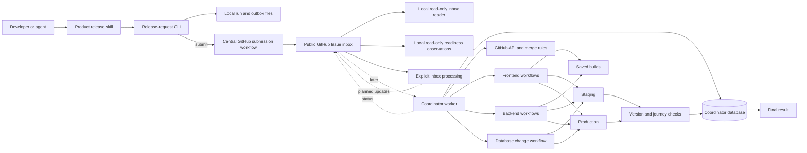

# Proposed release execution design

**Draft, not implemented release behavior.** The live system submits requests
and the local app verifies intake and inspects current readiness evidence.
It does not authorize or execute releases. See [progress](./progress.md) for
that boundary.
This document retains the written execution baseline formerly embedded in the
root README. The [process diagram](../release-coordinator-process.html) is a
separate step-by-step draft; it currently differs in the ways listed below.

## Inbox stage before execution

The implemented smaller stage is [inbox processing](./inbox-processing.md): central
intake defaults, clear ticket statuses and reasons, submitter ownership,
recorded decisions, and migration of existing tickets. This comes before the
local merge rehearsal. See progress for merge and runtime evidence.

The current intake boundary excludes requests whose PRs are all already merged:
processing closes them with `already-merged`, without claiming deployment.
A verified merged PR plus an open or unverified companion keeps the request open
for a scope decision; missing evidence alone can remain waiting. Deploying already
merged work uses the existing authorized product release process; a dedicated
deployment-only request mode is not implemented. A future worker must record
execution ownership before merging and keep responsibility afterward. Its own
merge must not trigger this intake closure rule. Inbox receipt acceptance and
ticket processing are not execution ownership.

That document owns the first-processing contract. It keeps the existing CLI input
and read-only commands, and introduces a separate explicit command for Issue
updates. It does not authorize release execution or settle the choices below.
The full execution design's lane, batch, and worker database should not be
introduced merely to organize tickets. The smaller processing stage still
uses its own GitHub decision journal, not the future worker database.

## Next bounded stage: sandbox merge rehearsal

The [testing plan](./merge-rehearsal-testing.md) defines local Git fixtures and
two proposed private GitHub repositories containing sample PRs. Its private
sandbox command will test exact commits, destinations, and merge order, with
separate evidence for conflicts, CI/review blockers, and changing inputs.
It is planned, not implemented. It does not consume real inbox requests or
change ticket decisions, shared branches, builds, or deployments.

This scope requires explicit test destinations and one documented merge method.
It does not settle the real release lane, timing of `main` changes, or artifact
policy below. Connecting rehearsal proof to real inputs and later execution
requires separate integration and fresh evidence.

## Decisions to settle before execution

These are pre-existing differences, not changes introduced by the inbox reader.
The written baseline dates from commit `6980d965` (August 25); the differing
process steps were revised in `7834ebfd` (August 28). Housekeeping has made the
conflict explicit rather than treating both drafts as an agreed implementation.

| Question | Written baseline below | Process diagram draft |
| --- | --- | --- |
| How many releases may progress at once? | One global lane stays reserved across main, staging, production, and recovery. | Staging and production have separate reservations; staging is released after validation. |
| When does `main` change? | After combined tests, before release builds and staging. | After staging validation, the production decision/build, and a saved recovery point. |
| What files reach production? | The same saved builds that passed staging. | Fresh production builds from the same validated commits, with environment-specific files/settings. |

Before a worker can merge, build, or deploy, choose and record these policies,
then update both views together. Also define how a `target: staging` request
stops after staging and what authorizes any later production continuation.
The request schema permits both targets; a full production story must not be
read as permission to promote a staging-only request.

The design below is retained for review, including its older choices. It is
not a second operational authority alongside the current product release
instructions. The historical Release Bus implementation has no design authority
for this new Coordinator.

## The problem

Many developers and agents want to release work at the same time. Today, merge
and deployment are too tightly connected:

- one deployment may require `main` to stay unchanged for a long time;
- another PR can merge while a deployment is running and invalidate a later
  `main` equality check;
- frontend and backend PRs may need a specific order;
- shared staging and production cannot safely accept overlapping mutations;
- someone must keep watching workflows, tests, retries, and recovery;
- it is difficult to answer what is queued, what is running, and what exact
  code is deployed.

The Coordinator should make release submission asynchronous and durable:

> Submit exact ready PRs and their dependencies. The system owns the release
> until it finishes or reaches a problem that genuinely needs a human.

## Core rule: one release lane

Only one batch may use the release lane at a time.

The active batch keeps the lane until the release finishes or recovery is
complete. While it owns the lane, no other batch may:

- freeze its versions;
- change `main`;
- use staging;
- deploy to production.

Developers may keep working on pull requests. Review and CI may also continue.
Those changes wait for a later batch before they can merge.

This is slower than running several releases at once. It is also easier to
understand and recover in version one. The Coordinator always knows which one
batch owns `main`, staging, and production.

## Product promise

A developer, automation, or agent can submit one release request containing:

- exact frontend and backend PR numbers and 40-character head SHAs;
- dependencies between release parts;
- selected backend deploy units and any release-specific dependencies;
- whether the frontend, backend, or both will change;
- whether the database changes;
- the requester's stated identity and request time.

The release JSON says what should be released. It does not prove who submitted
it. One trusted workflow in this Release Coordinator repository adds the real
GitHub actor, actor ID, and workflow run when it sends the request to the inbox.
The repositories, branches, and commits to release come from the JSON itself.

Once accepted, the Coordinator queues, merges, builds, deploys, tests, retries,
recovers, and reports the exact outcome. The submitter does not need to keep a
browser, terminal, or agent task open.

## Architecture



The Coordinator is a separate system. It coordinates the product repositories
but does not copy their build, deployment, journey-test, notification, or release-note
logic.

### Coordinator owns

- authenticated release submission;
- the durable cross-repository queue;
- dependency resolution and stable ordering;
- release state, attempts, ownership records, errors, and history;
- one global release lane;
- staging and production environment ownership;
- workflow dispatch and result correlation;
- exact saved batch records and build identities;
- retries, safe recovery, and notifications.

### Product repositories own

- PR review and CI;
- how frontend and backend code is built;
- how the backend is deployed;
- how the frontend is deployed;
- how database changes are applied;
- runtime version reporting;
- repository-specific checks and journey-test entry points;
- deployment communication and release-note implementations.

## Where inbox and queue state live

The first inbox is a set of GitHub Issues in this public repository. One issue
stores one accepted release request and its trusted submission proof. This is
enough to collect requests before the Coordinator starts doing release work.

Before release execution, the [inbox-processing plan](./inbox-processing.md)
adds a separate lifecycle for organizing these tickets. Its statuses and
decision history must not be confused with an executing release batch. Its
storage/writer design remains to be specified before implementing Issue writes;
editable labels alone are not that history.

The inbox is not the full release queue. When the Coordinator starts batching,
merging, building, and deploying requests, it will use its own database, such as
PostgreSQL. GitHub has one merge queue per repository, so it cannot hold the full
truth for one release that includes both frontend and backend.

Minimum durable records:

- release request and stated requester;
- trusted GitHub actor, actor ID, and central workflow run;
- ordered release items and dependency edges;
- exact PR heads and captured `main` SHAs;
- current state and state-transition history;
- merge, build, staging, production, and journey-test attempts;
- GitHub workflow run IDs and links;
- saved build checksums and running version identities;
- retry limits, blockers, ownership records, and human decisions.

Only the Coordinator changes queue state. GitHub statuses and PR comments are
useful projections, but they are not the authoritative queue.

## How progress is saved

Before each step starts, the Coordinator saves what it is about to do. It also
saves which worker is doing the work and when that worker last reported that it
was active.

After the step finishes, the Coordinator saves the result and the proof. It
moves to the next step only after this save succeeds.

Each release record shows:

- the current step and status;
- when the step started and finished;
- which worker is responsible;
- the result and its proof;
- the current blocker, if there is one;
- what should happen next.

If a worker stops, another worker reads this record and checks what really
happened before it continues. It does not trust browser memory or a workflow
success message.

If the start or result cannot be saved, the release stops. It does not move to
the next step or open the release lane while its state is unclear. Saving the
same progress again must be safe and must not create a second result.

## Sources of truth

| Fact | Source of truth |
| --- | --- |
| Accepted request and trusted submission proof | Public GitHub Issue plus verified central workflow evidence |
| Queue, order, and current release phase | Coordinator database, once processing exists |
| PR number, current exact head, review, and CI | GitHub |
| Saved build identity | Trusted build storage |
| What is actually running | Runtime version proof |
| Whether the running release works | Journey tests and health signals linked to the saved batch |

## How `main` is protected

`main` is always protected by GitHub repository rules. Normal users and agents
cannot push or merge directly. A narrowly permitted Release Coordinator GitHub
App is the normal merge actor.

The database queue decides order. GitHub rules enforce authority.

When a batch reaches the front of the queue, the Coordinator:

1. reserves the global release lane;
2. freezes the exact pull request versions and current `main` versions;
3. combines and tests the full batch on temporary branches;
4. checks the pull requests, approvals, CI, dependencies, and `main` again;
5. moves the tested result to `main`;
6. keeps the lane until the release or recovery is complete.

The final recheck and the change to `main` happen together. If anything changed,
`main` does not move.

GitHub cannot atomically merge two different repositories. Therefore:

- all cross-repository changes are fully preflighted before the first merge;
- backend changes must be safe to land before dependent frontend changes,
  normally through backward compatibility or a feature flag;
- if only part of the cross-repository merge succeeds, the release stops,
  records exact truth, and requires a deliberate repair;
- the system never claims that two repository merges were atomic.

An emergency administrator bypass may exist, but it is not part of the normal
release path and must be audited.

## Queue and release lane

Many requests may wait in the durable queue. Only one batch may become active.

The active batch owns one global lane across `main`, staging, and production.
No later batch may overtake it. A later batch starts only after the active
release finishes or recovery reaches a known safe result.

The lane is saved in the Coordinator database. It has an owner, a heartbeat,
and a current step. If the worker stops, another worker must prove that it can
continue safely before it takes over.

## Release lifecycle

The first state model is:

```text
SUBMITTED
  -> CHECKING
  -> WAITING
  -> ACTIVE
  -> PREPARING
  -> TESTING
  -> MOVING_MAIN
  -> BUILDING
  -> STAGING
  -> STAGING_VALIDATED
  -> PRODUCTION
  -> VERIFYING
  -> DONE
```

This is the successful path. If a release fails after `main`, staging, or
production changed, it leaves this path and enters `RECOVERING`. A successful
release never passes through recovery.

Important final or side states:

- `CANCELLED`
- `NEEDS_HUMAN`
- `RECOVERING`
- `RECOVERED`
- `FAILED`

Every transition is saved before later work begins. Operations are designed to
be safe to retry, and workers claim durable ownership so a restart cannot create
two owners for one mutation.

## Staging

For each release, the Coordinator:

1. applies the saved database change when the batch has one;
2. checks that the staging database change worked;
3. deploys the saved backend build;
4. deploys the saved frontend build after the backend is ready;
5. confirms the exact frontend and backend versions;
6. tests the important user journeys;
7. records `STAGING_VALIDATED` only when the versions and tests pass.

Staging validation belongs to the saved batch. A successful workflow is not
enough. The running versions and the user journeys must both pass.

## Production

Production receives the same saved builds that passed staging.

The Coordinator:

1. checks and saves the current production versions and last working builds;
2. applies the saved database change when the batch has one;
3. deploys the backend build;
4. deploys the frontend build after the backend is ready;
5. gives the release to more users slowly when the platform supports it;
6. confirms the exact production versions;
7. runs safe tests of important user journeys;
8. watches health for the full agreed time;
9. closes the successful release only when every check passes.

The Coordinator compares production with the saved batch. It never trusts a
deployment success message on its own.

## Recovery path

Recovery is a separate path. It runs only after `main`, staging, or production
changed and the release later failed.

The Coordinator:

1. stops the release and saves the exact current state;
2. chooses automatic recovery only when the database did not change and
   restoring the old code is safe;
3. restores the last working builds and adds new commits that undo the failed
   code, or follows the plan chosen by a person;
4. confirms the running versions, tests important user journeys, and checks
   system health;
5. closes the failed release and releases the lane only when the system is safe
   and its exact state is known.

These steps are shown as `R1` to `R5` in the process diagram. If the database
changed or anything is unclear, a person chooses how to recover. The lane stays
reserved until recovery is complete.

## Failure and recovery rules

### Database changes

The request says whether the database changes. The Coordinator also checks the
changed files. A yes from either source means database change.

The same saved database change runs in staging first and production later. It
runs before the backend deployment in this first design. Each environment must
report a clear result.

A database-changing release never recovers automatically. If it fails after the
database changed, the Coordinator saves the exact state and waits for a person.

### A waiting PR moves

Cancel or supersede the old exact request. Never silently deploy the new head.

### An active PR branch moves

The release continues with its already saved `main` commits and builds.
The newer PR head belongs to another request.

### Merge conflict or failed preflight

No release build is produced. The request becomes `NEEDS_HUMAN` with the
exact PR and blocker. Because `main`, staging, and production did not change,
the Coordinator releases the lane. Dependent work stays blocked, but unrelated
waiting work may continue in a later batch.

### Partial cross-repository merge

Stop. Record which `main` branch changed and which did not. Do not deploy or
pretend the merge was atomic. A human chooses the exact repair.

### Infrastructure failure

Retry only the same exact command and build within a fixed limit. An
AWS, GitHub, network, or runner failure is not evidence that a PR is bad.

### Build failure

Stop before staging. Because `main` already changed, the batch moves to the
recovery path. The lane stays reserved until `main` is repaired or a person
chooses another safe result.

### Staging application or journey-test failure

Do not validate the release. Move to recovery. A non-database batch may restore
the last working staging builds when every safety check passes. A
database-changing batch waits for a person.

Version one does not search for a smaller passing batch. The failed batch stops
with a clear reason.

### Production failure

Stop giving the release to more users. Save the exact running versions and
database state. A non-database batch may restore the saved builds and add new
commits to `main` that undo the failed code when every safety check passes. A
database-changing or unclear result waits for a person.

Recovery is complete only after the restored versions and health are checked.
The system never reports success from a workflow message alone.

### Stop request

- Before mutation, Stop cancels the release immediately.
- After mutation begins, Stop means safe stop. Finish or stop the active command,
  save the exact state, and enter recovery.

## Submit and almost forget

The API acknowledges a durable release ID. From that point, event-driven
workers and workflow callbacks continue the release without browser or agent
polling.

The submitter is notified only for meaningful outcomes:

- request accepted;
- staging validated;
- production completed;
- request cancelled because exact code changed;
- recovery completed;
- human action required, with the exact blocker and evidence links.

## Version-one scope

Version one should include:

- exact frontend and backend PR submission;
- explicit dependencies and deployment order;
- one durable database queue;
- one global release lane;
- GitHub-enforced protected `main` branches;
- one final safety check before `main` changes;
- saved batch records and builds that cannot change;
- clear database, backend, and frontend deployment steps;
- exact version checks and important journey tests;
- safe automatic recovery only for non-database releases;
- human recovery for database-changing or unclear releases;
- bounded infrastructure retries;
- final notifications and an operator dashboard.

## Explicit non-goals for version one

- automatic PR discovery;
- large automatic release trains;
- automatic search for a smaller passing batch;
- more than one active release batch;
- automatic recovery after a database change;
- pretending cross-repository merges are atomic;
- copying product build and deployment logic into the Coordinator;
- allowing two deployment authorities for the same environment;
- treating a successful workflow message as proof that deployment worked.

## Open decisions

- when the GitHub Issue inbox should move into the Coordinator database;
- GitHub App permissions and emergency access;
- maximum release size;
- exact merge implementation and repository rules;
- database change commands and version proof;
- gradual rollout support;
- runtime version proof for the frontend and backend;
- production health signals and limits;
- how the Coordinator proves workflow results are real and handles timeouts;
- retention and audit requirements;
- human recovery roles;
- disaster recovery for the Coordinator itself;
- how the Coordinator is deployed without depending on its own release path.

## Design influences

- [GitHub merge queues](https://docs.github.com/en/repositories/configuring-branches-and-merges-in-your-repository/configuring-pull-request-merges/managing-a-merge-queue)
- [GitHub deployment environments](https://docs.github.com/en/actions/reference/workflows-and-actions/deployments-and-environments)
- [Google Cloud CI/CD guidance](https://cloud.google.com/solutions/best-practices-continuous-integration-delivery-kubernetes)
- [Google SRE canary guidance](https://sre.google/workbook/canarying-releases/)

These sources informed the draft. Settle the decisions above and align the
written plan with the process diagram before implementing release execution.
A future implementation must not silently choose between conflicting drafts.
